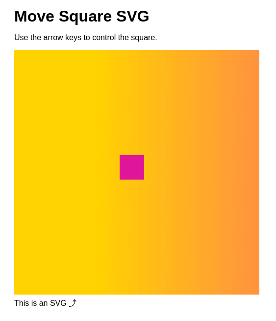

  

## Technologies Used

&nbsp;&nbsp;&nbsp;&nbsp;&nbsp;&nbsp;

&nbsp;&nbsp;&nbsp;&nbsp;&nbsp;&nbsp;

## Description

A simple SVG example featuring a movable square. An SVG image is regenerated using JavaScript, when a keyboard arrow is pressed.

## License

Copyright (c) 2023 Michael Kolesidis 
Licensed under the [GNU Affero General Public License v3.0](https://www.gnu.org/licenses/agpl-3.0.html).
